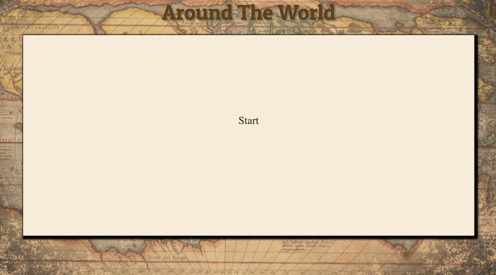
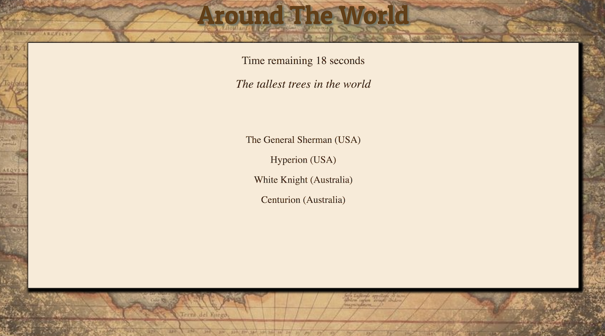
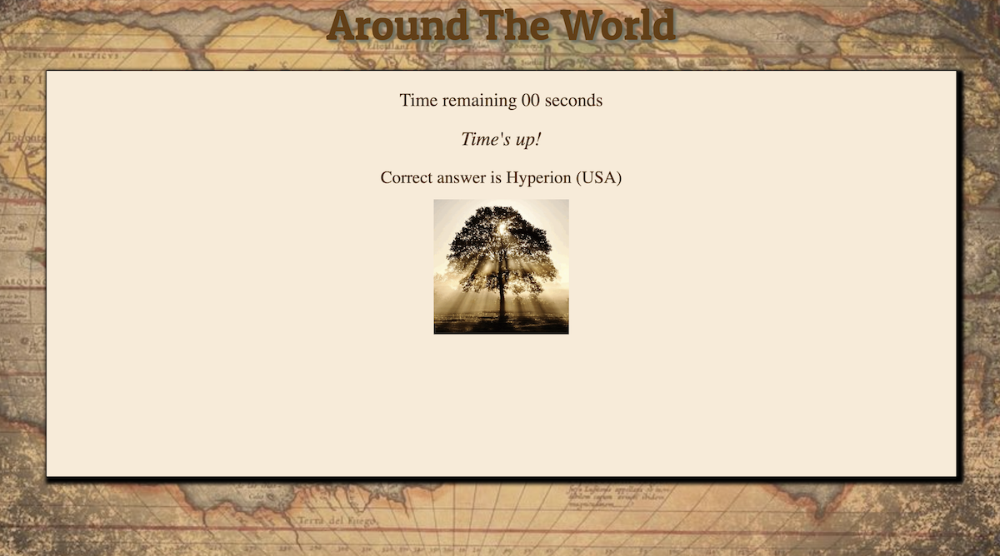

# TriviaGame

## Around The World

## LINK

https://abareyan.github.io/TriviaGame/

## Screen Shots

## About the game

In this game, you will find interesting facts about our world, for example, the longest river, the largest tree, etc., expand your knowledge about it.

## How to play this game.

1. You must press the button start for starting the game.

2. In the top of the page, you can see your time (you have only 25 seconds for each question).

3. Under of the time you see the question

4. On the bottom, you see 4 answers. One of them is correct.

## Rules

1. You must press on one of the answers.

2. If your answer is correct you'll see "Correct!", after a few seconds you'll see the next question

3. If your answer is incorrect you'll see "Nope!" and correct answer, after a few seconds you'll see the next question

4. If your time is up (you have only 25 seconds for each question) you'll see "Time's up!" and correct answer, after a few seconds you'll see the next question

5. The game ends when you answer all the questions, whether correct or not!

GOOD LUCK!

## Author

* **Arman Bareyan** [ABareyan](https://github.com/ABareyan)

## License

No license agreements, do as you will with the program. 